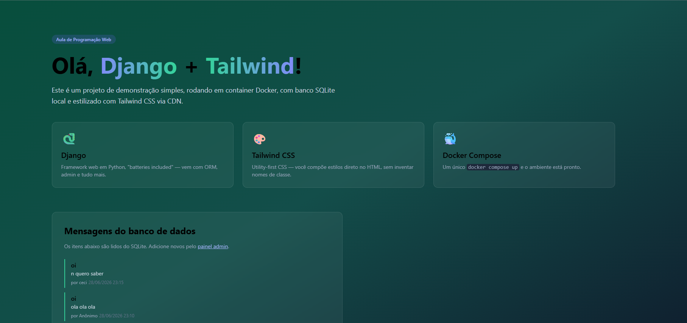
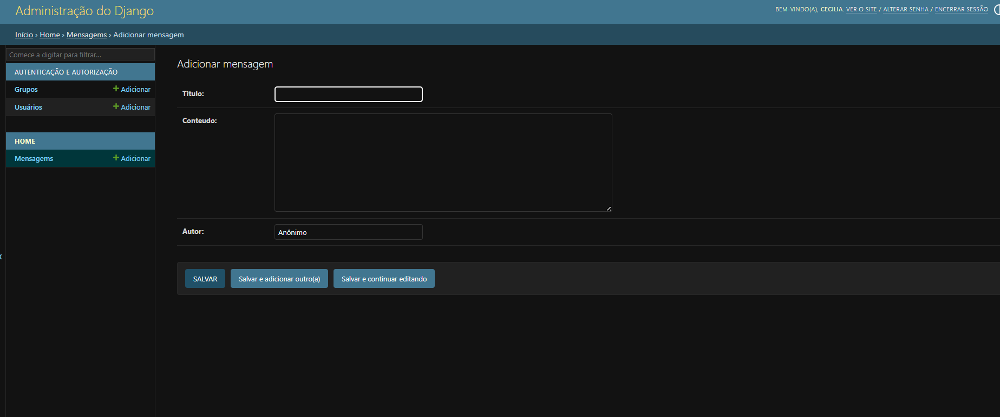
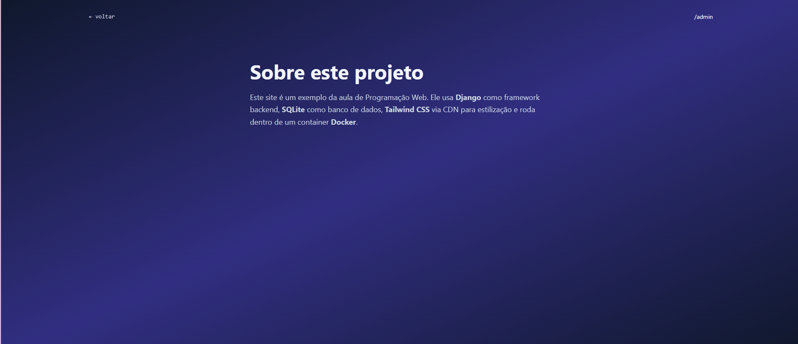

# Demo Django + Tailwind com Docker

Este é um projeto simples construído com **Django** (framework web em Python), banco de dados **SQLite**, estilizado com **Tailwind CSS** (via CDN) e preparado para rodar em containers utilizando o **Docker Compose**. 

O projeto serve como uma demonstração (Aula de Programação Web) contendo uma página inicial que lista mensagens salvas no banco de dados, uma página "Sobre" e o poderoso painel de Administração do Django (`/admin`).

## 📸 Telas do Projeto

### 1. Página Inicial
A página inicial (`/`) exibe os cards com as tecnologias usadas e a listagem de mensagens carregadas diretamente do SQLite em tempo real.



### 2. Painel Admin (Django)
O painel de administração nativo do Django (`/admin`) permite que você gerencie o banco de dados. Na imagem que você enviou, é a tela de adição de **Mensagens** (onde você preenche Título, Conteúdo e Autor).



### 3. Página Sobre
Uma rota adicional (`/sobre/`) que demonstra o sistema de navegação e templates do projeto, mantendo a identidade visual elegante e escura configurada via Tailwind CSS.



---

## 🚀 Como Executar o Projeto

Como a aplicação já foi "dockerizada", rodá-la no seu ambiente local é extremamente rápido. Não é preciso instalar o Python na sua máquina, apenas o Docker.

### Pré-requisitos
* **Docker** e **Docker Compose** instalados e rodando.

### Passo a Passo

1. **Faça o clone do projeto** e entre na pasta raiz (onde fica o `docker-compose.yml`):
   ```bash
   git clone <url-do-seu-repositorio>
   cd django_app
   ```

2. **Suba o container com o Docker**:
   Execute o comando abaixo. Ele fará o build da imagem, aplicará as migrações no banco de dados (graças ao script no `docker-compose.yml`) e subirá o servidor.
   ```bash
   docker compose up --build
   ```
   *(Dica: Se o terminal travar no log e você quiser rodar em segundo plano, adicione `-d` no final: `docker compose up -d --build`)*

3. **Acesse no seu navegador**:
   - 🏠 Página Principal: [http://localhost:8000](http://localhost:8000)
   - ℹ️ Sobre: [http://localhost:8000/sobre/](http://localhost:8000/sobre/)
   - ⚙️ Painel de Admin: [http://localhost:8000/admin/](http://localhost:8000/admin/)

---

## 🛠 Como acessar o Painel Admin?

Para fazer login no `/admin` e adicionar novas mensagens (como visto na sua imagem), você precisa criar um superusuário.

Com o container rodando, abra **outro terminal** e rode o seguinte comando:
```bash
docker compose exec web python manage.py createsuperuser
```
*O terminal pedirá um nome de usuário, e-mail (opcional, pode dar enter) e uma senha.*
Depois disso, é só ir no `/admin` e logar com os dados criados!

---

## 📂 Estrutura do Projeto

* `core/`: Configurações principais do projeto Django (`settings.py`, `urls.py`).
* `home/`: O aplicativo que gerencia o modelo `Mensagem` e as views (`index` e `sobre`).
* `templates/home/`: Os arquivos HTML usando **Tailwind CSS**.
* `Dockerfile` e `docker-compose.yml`: Receita e orquestração do ambiente Docker.

---
**Feito para a aula de Programação Web · Django 6**
